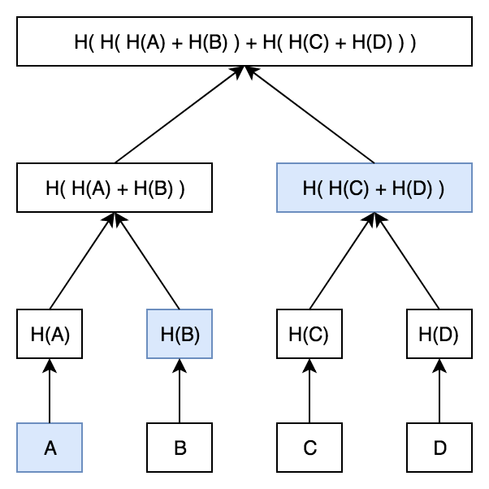
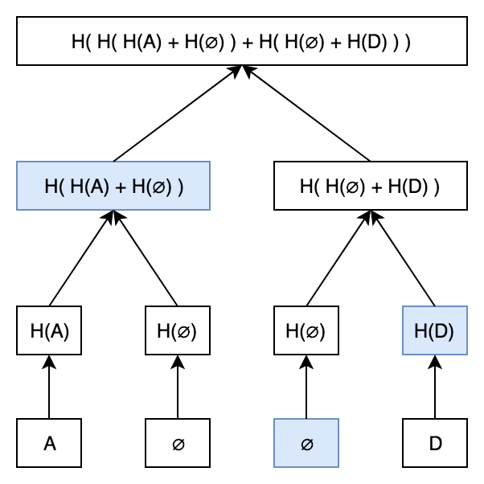
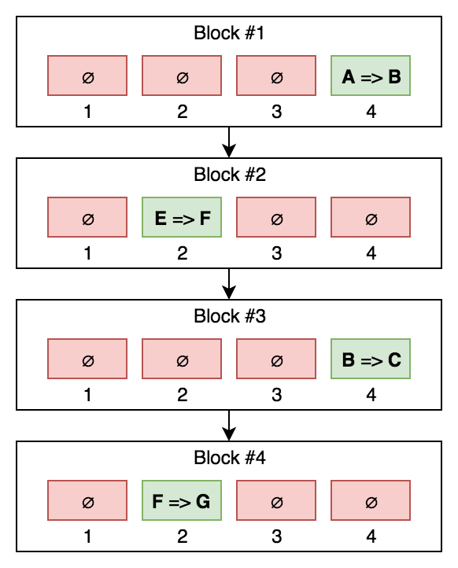

==================================================
How Plasma Cash makes lightweight clients possible
==================================================

Plasma Cash gets its name because it's perceived to act similar to cash — i.e., bills that cannot be divided or cut up to
represent different values. Plasma Cash has "bills" that denominated in standard values, such as $10, $20, $50, and
$100, represented as **non-fungible tokens(NFTs)**. Each deposit into the Plasma Cash smart contract is treated
like a bill and indivisible. Plasma Cash utilizes unique identifiers when depositing ETH into a Plasma contract that
allows clients to only store information about their NFT. But even then, the client-side storage requirements can be excessive, as it is required to store and maintain an ever-growing history of transactions, inclusion proofs, and
non-inclusion proofs.

An NFT could represent anything. A fixed denomination of ether or an ERC-20 token, a bundle of
ERC-20 tokens, or a litter of cryptokitties. The only requirement is that it can be represented as an ERC-721 asset — which
essentially just means it is something unique that can't be split or merged.

Plasma Cash ditches the Bitcoin-esque UTXO (Unspent Transaction Output) model of MVP (Minimum Viable Plasma) with NFTs, the notion of creating new transaction outputs no longer applies. Instead, each NFT is accounted for in each Plasma
block. The presence of an NFT indicates that the NFT changed owners in that Plasma block (i.e., Alice sent it to Bob). Absence indicates that it still has the same owner as it did in the previous block. Thus, the full history of an NFT can be
described by its absence or presence in each Plasma block, from the current block all the way back to the block in which
it was first deposited.

In order for Bob to prove the presence of his NFT in a given block, he only needs the transaction's Merkle path. However,
to prove that the NFT was not transferred in a given block, Bob requires the ability to prove absence of data, a feature
not supported by the Merkle Trees we know and love.

    A diagram of Merkle tree

Thus, to enable this "proof of absence" capability, Plasma Cash uses a souped-up Merkle Tree construct known as a Sparse
Merkle Tree (SMT). SMTs are Merkle trees with an additional, special feature: the leaves of the tree (the NFTs, in our case)
are each given a unique identification number which determines where in the tree they reside. Essentially, a sorted
ordering is imposed on them; each coin can only reside in its allotted "slot". What this means is that if a coin is absent,
we know where it would be if it were present, and thus, we are able to prove its absence with a Merkle branch that shows
that its slot is "empty" (i.e., equal to some null value — zero, "undefined," whatever).

The key takeaway is that the data requirement for proving this history consists of one bite-sized Merkle proof per
block, as opposed to MVP's full Plasma blocks requirement. Plasma light client secured!

Let's now explore the claim that this sequence of Merkle proofs is enough for the coin's current owner to secure their
funds. In other words, as long as Steve has the full history of his coin (in the form described above), he has objective
assurance that:

1. If/when he tries to withdraw, he will have the appropriate response to any challenges.
2. If/when anyone else tries to withdraw his coin, he will be able to challenge and successfully overturn the withdrawal.

Sparse Merkle Trees
===================

Sparse Merkle trees give us efficient proofs of non-inclusion. A sparse Merkle tree is like a
standard Merkle tree, except the contained data is indexed, and each datapoint is placed at the leaf that corresponds to
that datapoint's index.

Let's prove that A is part of the above tree. We need to provide each of A's siblings on the way up the tree, recompute
the tree, and make sure everything matches.

With just A, H(B), and H(H(C)+H(D)), we can recompute the original root hash. This is an efficient way to show that A is
part of this tree without having to provide the entire tree!

What if we want to prove that something isn't part of
the tree? Unfortunately, standard Merkle trees don't give us any good way to do this. We could reveal the entire contents,
but that's sort of defeating the point of using a Merkle tree in the first place.

Here's where the magic happens. What happens if we want to prove that C is not part of this Merkle tree? We know
that if C were part of the tree, it would be at the third leaf. If C isn't part of the tree, then the third leaf must be
null.

All we need is a standard Merkle proof showing the third leaf is null!

There are some techniques to efficiently generate Merkle trees. The key to these techniques is that these giant
sparse Merkle trees are mostly sparse. H(null) is a constant value, and so is H(H(null)), etc. You can cache huge chunks of the
tree.

Source: Efficient smt:https://eprint.iacr.org/2016/683.pdf

Sharded client-side validation
^^^^^^^^^^^^^^^^^^^^^^^^^^^^^^

Clients only need to watch the Plasma chain for their tokens. That means transaction
throughput can scale without increased load on individual users.

Minor Mass Exit Mitigation
^^^^^^^^^^^^^^^^^^^^^^^^^^

Mass exits are less worrisome because a thief must submit an exit transaction for
each token they wish to steal. If a chain halts tokens are still safe. There is still an interruption in service.

Simple support for all tokens
^^^^^^^^^^^^^^^^^^^^^^^^^^^^^

There is no additional complexity adding any number distinct tokens, including non-fungible assets.

A downside is *Large token denominations*

Because each token must be assigned a serial number, one cannot mint arbitrarily small tokens.
This is because at some point the gas cost of redeeming the token will be larger than the value of the token itself.

For every block in the Plasma Cash chain, a merkle root must be published to the root chain. This root can either be a
merklized list, or a merkle patricia tree. In the merklized list, each index of the leaf nodes corresponds to the token ID.
The values of the leaf nodes are Plasma transactions.

Transactions take the form of::

    [[prev_hash, prev_block, (target_block?), token_id, new_owner], signature]

A transaction spending a token with a given ``token_id`` is only valid if it is included in the Merkle tree at position
``token_id``. That is, for each token, there is only one "place" in the Merkle tree where transactions spending that token are
allowed to be.

Deposits
^^^^^^^^

Anyone can call a ``deposit()`` function of the Plasma contract, which mints a new token into existence with the amount of
ether sent along with the call as the denomination.

Withdrawals
^^^^^^^^^^^

Starting an Exit
****************

When a user wants to withdraw (or "exit") a token, they need to submit the two latest transactions in the token's history. For example,
if C wants to withdraw token #4, they need to provide the "child" (most recent) transaction from B to C, and the "parent"
transaction from A to B. The user also needs to submit Merkle proofs that show both transactions were included in the
blockchain.

Challenging exits
*****************

We support three types of challenges to ensure that only the true owner of a token can withdraw that token.
Withdrawals can be blocked if someone proves that the withdrawing user actually spent the token later.
Withdrawals can also be blocked if someone shows that there's a transaction between the parent and the child
transactions, meaning the withdrawing user provided an invalid parent.

Someone can also challenge the withdrawal by providing some other transaction in the token's history. This type of
challenge doesn't immediately block a withdrawal. Instead, the withdrawing user is forced to respond with the transaction
that comes after the provided transaction.

Exits
*****

Anyone can exit their NFT by providing the last two transactions in the NFT's ownership history (i.e., the NFT they are
exiting C and its parent P( C )).

Someone can challenge an exit in three ways, by providing:

1. Proof of a transaction spending C
2. Proof of a transaction spending P( C ) that appears before C
3. A transaction C* in the NFT's history before P( C )

A challenge of type 1 and 2 blocks the exit immediately. A challenge of type 3 can be responded to by providing
the direct child of C*, which must be either equal to or before P( C ).

Would coin ID => denomination be stored as a mapping on the root chain?
A non-inclusion proof is basically a proof that there exists an object at the given position in the Merkle tree, and this
object is empty data.

Pros and cons
=============

Plasma Cash is unsuitable for use cases where fractions of tokens are necessary, like exchanges.

Additionally, the proofs that need to be sent along with each transaction can grow quickly. These proofs need to go
all the way back to the block in which the token was deposited. Once the Plasma Chain has been running for a while, these
proofs might get prohibitively large.
Plasma Cash is still great for certain things. Support for non-fungible tokens makes Plasma Cash perfect for things like
supply-chain logistics or even card games!.
